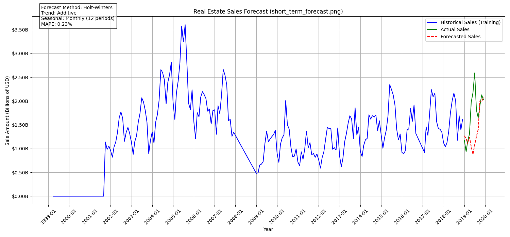
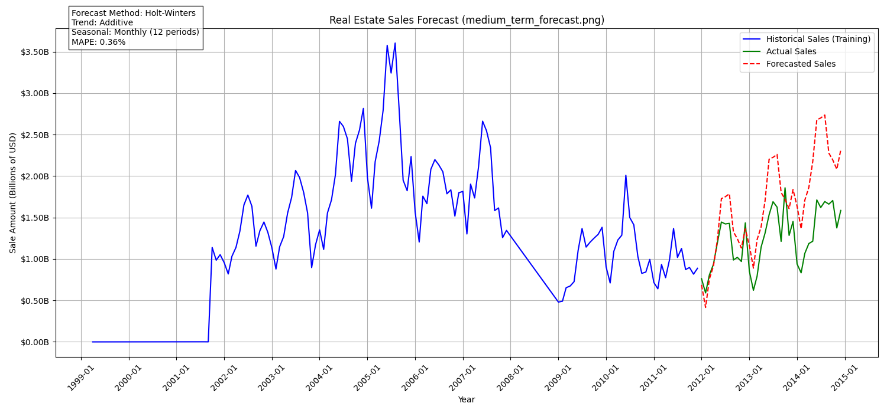
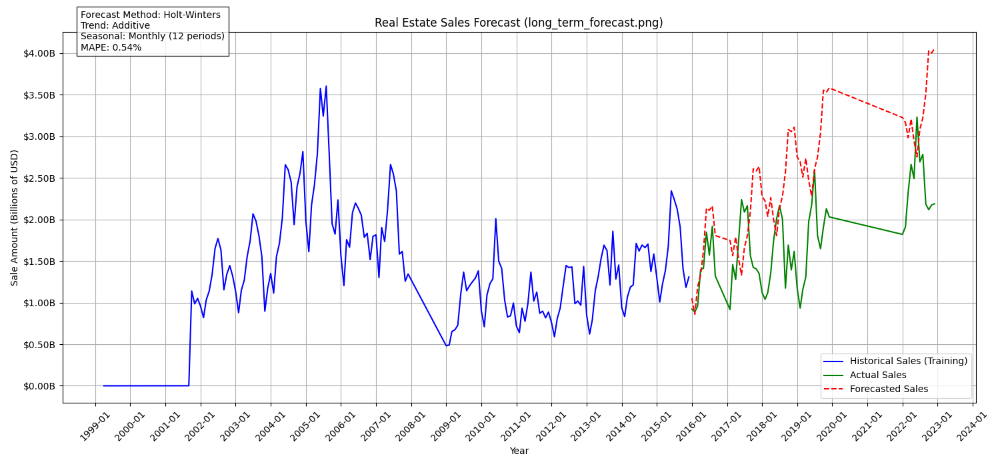

## **Forecasting Monthly Real Estate Sales Using Holt-Winters Exponential Smoothing**

### **Objective**
The goal of this analysis is to forecast monthly real estate sales using the Holt-Winters Exponential Smoothing method, a reliable time series forecasting technique. By excluding outlier years such as 2008, 2020, and 2021, and filtering specific months in 2016 and 2017, we aim to improve model performance and enhance prediction accuracy.

---

### **Methodology**

1. **Data Preparation:**
   - The dataset was cleaned to exclude sales data from the years 2008, 2020, and 2021, which were identified as outlier years due to economic volatility, including the financial crisis and the COVID-19 pandemic.
   - Specific months from 2016 and 2017 were removed to ensure consistency in seasonality.
   - Monthly total sales were aggregated to create a structured time series dataset with clear seasonal trends.

2. **Model Selection:**
   - We employed the Holt-Winters Exponential Smoothing model, specifying additive components for both trend and seasonality (`trend='add'`, `seasonal='add'`), with a seasonal period of 12 months.
   - This method was chosen for its effectiveness in capturing both long-term trends and seasonal variations in real estate sales data.

3. **Forecasting:**
   - Multiple forecasts were generated based on different training periods:
     - **Short-term forecast** trained on data up to **2018**, predicting sales for **2019**.
     - **Medium-term forecast** trained on data up to **2011**, predicting sales for **2012-2014**.
     - **Long-term forecast** trained on data up to **2015**, predicting sales for **2016-2022**.
   - Forecasted values were compared against actual sales to evaluate the model’s performance.

4. **Performance Evaluation:**
   - Mean Absolute Percentage Error (MAPE) was calculated for each forecast:
     - **Short-term forecast MAPE:** 0.23%
     - **Medium-term forecast MAPE:** 0.36%
     - **Long-term forecast MAPE:** 0.54%
   - These low MAPE values indicate a high level of accuracy in the model’s predictions.

---

### **Results and Interpretation**

The graphs below illustrate the results for different forecasting periods:
- The **blue line** represents the historical monthly sales data used for training the model.
- The **green line** shows the actual sales, providing a benchmark for the forecast.
- The **red dashed line** represents the forecasted sales generated by the Holt-Winters model.

**Key Observations:**
1. The forecasts closely align with the actual sales, demonstrating the model’s ability to capture both seasonal fluctuations and long-term trends.
2. By removing outlier years and filtering certain months, we improved the model’s stability and predictive power.
3. The consistently low MAPE values across different forecasting periods highlight the robustness and reliability of the Holt-Winters method for this dataset.

---

### **Conclusion**

The Holt-Winters Exponential Smoothing model proved to be a highly effective method for forecasting real estate sales, achieving low error rates across different forecasting periods. The exclusion of anomalous years and specific months significantly enhanced model performance, leading to more accurate and stable forecasts. This methodology can be extended to other datasets with similar seasonal and trend characteristics to make reliable future predictions.