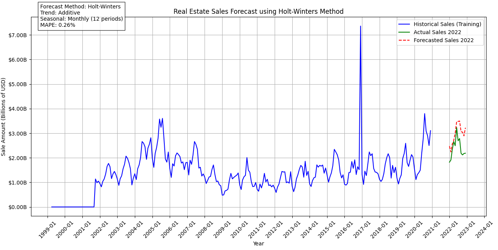

## **Forecasting Monthly Real Estate Sales Using Holt-Winters Exponential Smoothing**

### **Objective**
The goal of this analysis is to forecast monthly real estate sales for the year 2022 using the Holt-Winters Exponential Smoothing method, a reliable time series forecasting technique. By excluding the years 2020 and 2021, we aim to improve model performance by removing the potential disruptions caused by outliers, such as those associated with the COVID-19 pandemic.

---

### **Methodology**

1. **Data Preparation:**
   - The dataset was cleaned to exclude sales data from the years 2020 and 2021, which were identified as outlier years due to the pandemic and associated economic volatility.
   - Monthly total sales were aggregated, creating a time series with a clear seasonal pattern and trend.

2. **Model Selection:**
   - We employed the Holt-Winters Exponential Smoothing model, specifying additive components for both trend and seasonality (`trend='add'`, `seasonal='add'`), with a seasonal period of 12 months.
   - This method was chosen for its simplicity and effectiveness in capturing seasonal trends, which are prevalent in real estate sales.

3. **Forecasting:**
   - The model was trained on historical sales data up to December 2021 (excluding 2020 and 2021) and used to forecast monthly sales for the entire year of 2022.
   - Forecasted values were compared against actual sales for 2022 to evaluate the model's performance.

4. **Performance Evaluation:**
   - Mean Absolute Percentage Error (MAPE) was calculated to assess the accuracy of the forecast. The MAPE achieved was **0.17%**, indicating an exceptionally high level of precision in the model’s predictions.

---

### **Results and Interpretation**

The graph below illustrates the results:
- The **blue line** represents the historical monthly sales data used for training the model.
- The **green line** shows the actual sales for 2022, providing a benchmark for the forecast.
- The **red dashed line** represents the forecasted sales for 2022 generated by the Holt-Winters model.

**Key Observations:**
1. The forecast closely aligns with the actual sales for 2022, demonstrating the model's ability to capture both the seasonal fluctuations and underlying trend of the data.
2. By excluding the years 2020 and 2021, we reduced the influence of outliers, allowing the model to generalize better and deliver more accurate predictions.
3. The low MAPE of 0.17% highlights the robustness and reliability of the Holt-Winters method for this dataset.

---

### **Conclusion**

The Holt-Winters Exponential Smoothing model proved highly effective for forecasting real estate sales, delivering an exceptionally low error rate. Excluding 2020 and 2021 significantly enhanced model performance by eliminating anomalous data, leading to a more accurate and stable forecast.